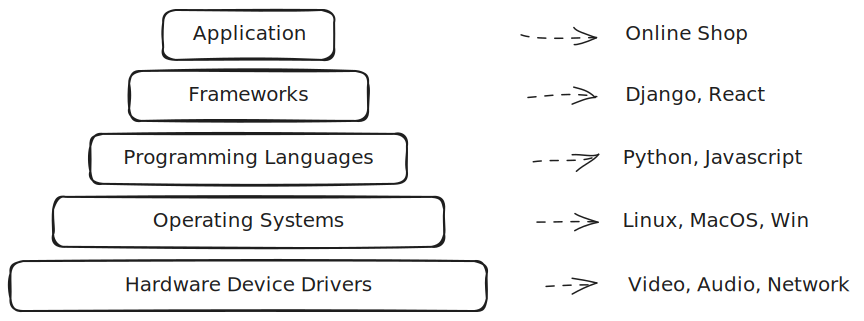

# Basics of Structured Programming

## Understanding the Programming Pyramid

Imagine a pyramid that helps us understand how computers work. At the top, we
have what you see and use every day on your computer or phone. As we move down,
things get more technical, ending with the nuts and bolts of the computer that
make everything run.




## Programming Building Blocks

> Think of a computer as a very smart calculator that can do more than just add
> or subtract numbers.
> It can also remember things!

When we give data to computers, they help us make sense of it. Let's say you
have a list of who owes you virtual money (crypto?):
- The list has names and amounts (like a fancy checklist).
- It tells you who has paid and who hasn’t.

Here’s what a computer program composed of:
1. **Data** - This is the information, like the names and amounts.
2. **Behavior** - This is what the computer does with the data. For example:
    ```python
    if someone_has_paid:
        say_thank_you()
    ```

## Storing Data

### Basic Data Types:
- **None** - When there’s nothing there (like an empty box).
- **Numbers** - Just like the numbers you use every day.
  - **Whole numbers** (like 1, 2, 3...)
  - **Decimal numbers** (like 0.01, 2.3...)
  - **Complex numbers** - These are a bit tricky (like numbers with an imaginary part).
- **Yes or No** (True or False) - Like answering a yes-no question.
- **Words or sentences** - Anything you can write in quotes.

### Compound Data Together

1. **Dates and Times**
   - **Dates** are like calendar entries.
   - **Times** are your clock readings.
   - **Timestamps** tell you the exact moment something happened, counting from a special date.

2. **Lists** - Just like your grocery list, where you can see the order:
   ```python
   my_list = [apples, oranges, milk]
   print(my_list[1])  # This shows 'oranges'
   ```

3. **Sets** - Like a bag where you only keep one of each thing, no duplicates:
   ```python
   my_bag = {apple, orange, banana}
   ```

4. **Dictionaries** - These are like personal address books where you store information that comes in pairs:
   ```python
   my_book = {
       "name": "Alice",
       "number": "555-1234",
       "is_friend": True
   }
   ```

