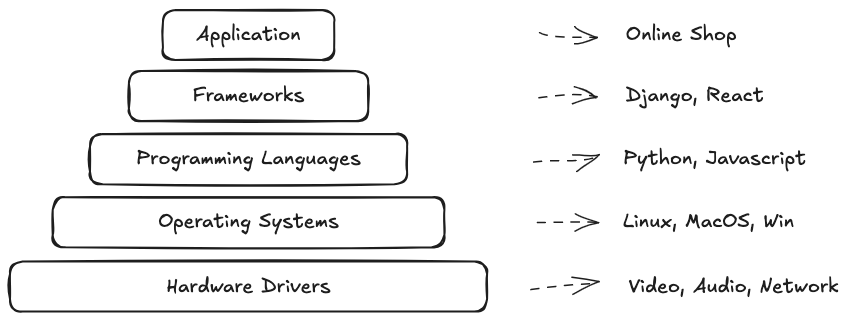

# Structured Programming Basics

## Computer programming pyramid




## Programming Building Blocks

> CPU can only do the following basic arithmetic operations: addition, subtraction,
> multiplication, division and read/write operations.

Interpreting data gives it meaning. For example, an invoice might include:
- Invoice series and number (`JIBE-000x`)
- Invoice status (`"created" | "accepted" | "paid" | "rejected"`)
- Numeric representations (`1` for created, `2` for accepted, etc.)

1. **Data** - Represents values and their meanings.
1. **Behavior** - Includes actions, decisions, and conditions.
    Example:
    ```python
    if some_condition:
        perform_action()
    ```

## Data storage

### Basic Data Types:
- **None** (represents no value, e.g., `null`, `undefined`)
- **Numeric** (used for numbers)
  - **Integer** (whole numbers like -2, -1, 0, 1, 2, 123, ...)
  - **Floats** (numbers with a decimal point like 0.01, 2.3, 3.3333)
  - **Complex** (numbers with a real and imaginary part, e.g., `a + bj`)
- **Boolean** (logical values, e.g., `true` or `false`)
- **Character** (text, always enclosed in quotes, e.g., `"Hello, world!"` or `'This is also text'`)

### Compound Data Types

1. **DateTime** (combines date and time)
   - **Date** (formatted as D/M/Y)
   - **Time** (formatted as h:m:s/ms/us)
   - **Timestamp** (seconds since January 1, 1970)
2. **Lists** (ordered collection of items)
   - Example:
     ```python
     odd_numbers = [1, 3, 5, 7, 9]
     print(odd_numbers[2])  # Outputs: 5
     ```
3. **Sets** (unordered collection of unique items)
   - Example:
     ```python
     unique_numbers = {1, 2, 13, 14}
     ```
4. **Dictionaries** (collections of key-value pairs)
   - Example:
     ```python
     invoice = {
         "date_issued": 1725893713,
         "series": "JIBE",
         "number": 121,
         "items": [...],
         "currency": "EUR",
         "total_price": 123.9999,
         "vat": 14.4212354,
         "status": "accepted",
         "paid": False
     }
     ```

